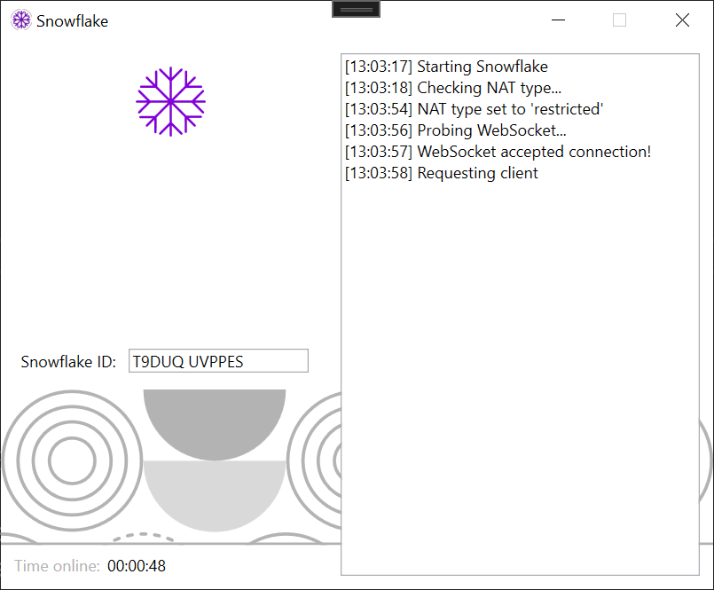

# Snowflake

This is a Snowflake client, for Windows. Check out the project at
[snowflake.torproject.org](https://snowflake.torproject.org/).

This entire project is merely a translation of the original Snowflake client
([available here](https://snowflake.torproject.org/embed.js)), written in
JavaScript.

---

**Disclaimer:** this client does **not** work as of writing. Only tested on
Windows 10 (21H1) Build 19043.

In summary, after a client is found, the connection times out, because the RTC
data channel never opens (`peerconn.ondatachannel` is never triggered). I don't
know why.

All assets come from the Tor project. I admit I didn't check the licenses
🙈 so don't reuse anything before I get around to doing that.